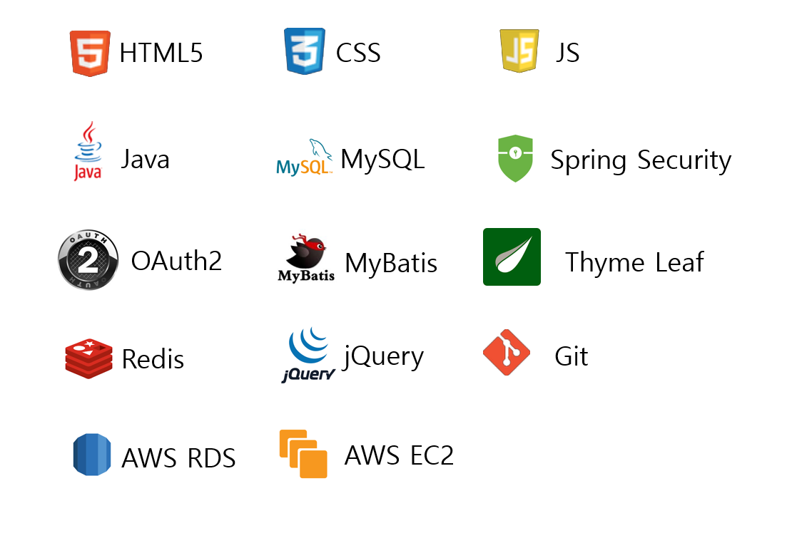
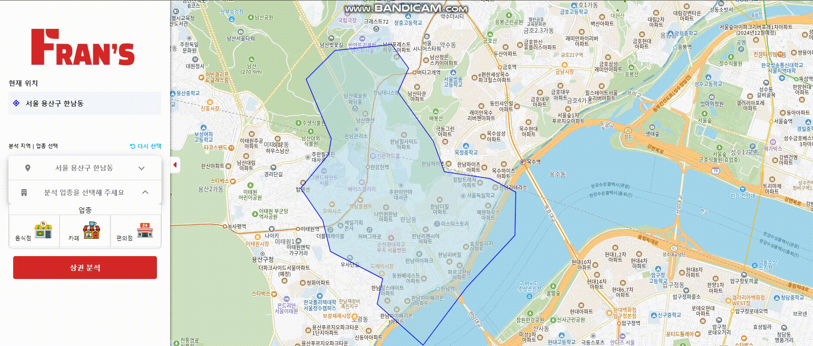

# 프랜차이즈 정보들과 커뮤니티 - Fran’s

## 프로젝트 개요

Fran's는 프랜차이즈 창업 정보를 제공하고, 지역 및 분야별 커뮤니티를 통해 상권 정보를 공유하는 서비스입니다.

### 진행 기간

- 2024년 7월 1일 → 2024년 7월 16일

### 인원
- 정상필, 유지명, 이지훈, 이환희

### 핵심기능

🔒**회원 가입을 통한 커뮤니티 이용** 

**📖프랜차이즈의 카테고리 별 창업 정보 검색**

**🔎지역 검색 및 선택을 통한 근처 상권 검색**

### 📖노션

[노션](https://www.notion.so/Team-Project-Template-4f0be32c156e40f1baaa1dff3ab6e07d?pvs=4)

## 🛠️ 개발 환경

## ↔️ ERD

### 구현 기능

<aside>
💡 상권 분석 페이지 - 사이드바 토글

</aside>

<aside>
💡 상권 분석 페이지 - 드랍다운 메뉴 클릭 이벤트

</aside>

<aside>
💡 상권 분석 페이지 - 폴리곤 클릭이벤트 및 상권분석버튼 이벤트

</aside>

<aside>
💡 상권 분석 페이지 - 폴리곤 활성화

</aside>

